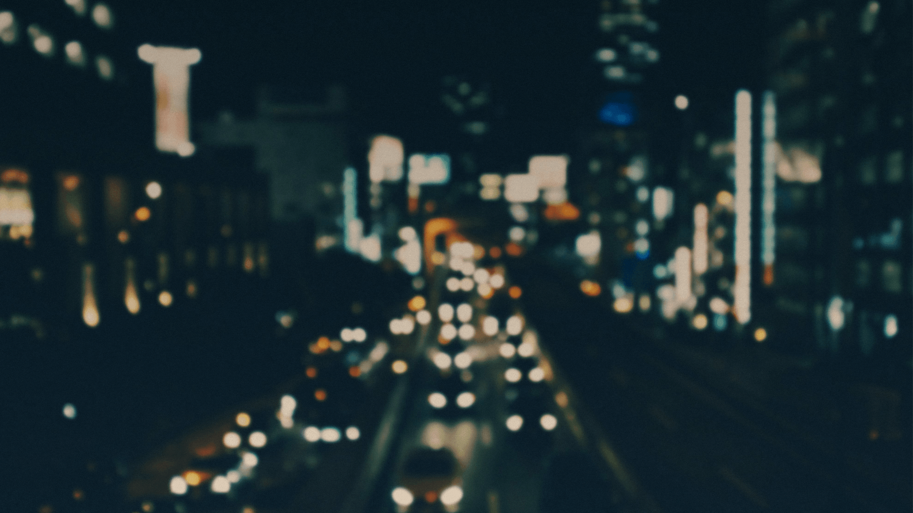

# Advanced 3d Perspective Distortion
## Enhanced by [BrowserStack](http://browserstack.com/)

[](http://opensource.org/licenses/MIT)

#### Create a unique parallax environment to show off your work.
#### Inspired by http://hellomonday.com/


I've always been a big fan of using subtitle 3d effects to give depth to UI and images. Ever since laying my eyes on the [26000 Vodka] (http://26000.resn.co.nz/flash.html) website many years ago, I've wanted to create something that can emulate that same kind of depth, without using cumbersome flash to do it. (Also, I didn't know flash, so there's that)

This plugin allows you to (currently) do full-page 3d perspective transforms base on mouse position. There are a lot of options you can tweak to your liking, and I'm looking to develop the application of this effect further.

[Check out the demo's to see whats possible](http://hellsan631.github.io/LogosDistort/)

### New In v0.3

1. JQuery no longer a requirement.
2. Multiple element on screen now supported. [see demo5.html](http://hellsan631.github.io/LogosDistort/demo5.html)
3. Added new mouse movement listeners. [see demo5.html](http://hellsan631.github.io/LogosDistort/demo5.html)
4. _New Option:_ __perspectiveMulti__
5. _New Option:_ __depthOverride__
6. Fixed a few bugs, performance should be more consistent now.

__Note: When 1.0 hits, the file name will drop the jQuery prefix__

## Usage

There are two ways of using LogosDistort. By Using bower:
```   
bower install logos-distort
```
Or by downloading the repo and using the files there

1. Include jQuery (optional):

	```html
	<script src="http://ajax.googleapis.com/ajax/libs/jquery/2.0.0/jquery.min.js"></script>
	```

2. Include plugin's code: (javascript and stylesheets)

	```html
	<link href="dist/css/perspectiveRules.css" rel="stylesheet" />
	<script src="dist/jquery.logosDistort.min.js"></script>
	```

3. Add the HTML Structure:

	```html
	<div id="demo1">
      
      <div id="particle-target" ></div>
      
  </div>
	```

> The structure can include any element, but currently only has support for full screen elements. If you'd like to make non-full screen elements respond to the matrix transform, then simply place the elements inside of a full screen div container. An example of this can be seen in demo4.html


4. Call the plugin:

	```javascript
	$("#demo1").logosDistort(options);

	//or non jquery way

	var distortion = new logosDistort(document.getElementById('demo1'), options);
	```

> You can customize a number of options and send them in when starting the plugin. See "Options" for more info.


> __Note:__ When setting multiple elements to use the effect, each of their containers needs to
> have position:relative in their css style. [See demo5.html](https://github.com/hellsan631/LogosDistort/blob/master/demo/demo5.html#L18)

## Options

> __EffectName:__ "default" _(type)_<br/>
>	Description

1. __enable:__ true _(boolean)_ <br/>
	Enable/disable the effect

2. __effectWeight:__ 1 _(number)_ <br/>
 	The weight of how much the background parallaxes based on mouse movement. Lower means a smaller
	window of movement, higher means more. Higher values also may introduce clipping depending on the
	depth of your scene.

3. __enableSmoothing:__ true _(boolean)_ <br/>
	Enables smoothing of the mouse so that the perspective change on mouse movement isnt exactly 1:1

4. __smoothingMultiplier:__ 1 _(number)_ <br/>
	A multipler for the time it takes for the parallax effect to center on the mouse cursor. Higher
	means more time, lower means the animation is faster.

5. __mouseMode:__ "container" _(string)_ <br/>
	Changes how mouse movement triggers the parallax effect. This has 3 settings, _"container"_,
	_"window"_, and _"magnetic"_. The default (container) binds it so that the parallaxing only
	changes when the mouse is inside of the container, like wise window means that the mouse updates
	will be bound to the window. __Magnetic__, however, allows tracking of the mouse on X and Y planes.
	The effect will update when the mouse is on the same x or y plane as the base element.

6. __outerBuffer:__ 1.10 _(number)_ <br/>
	A size multiplier for the backgrounds, so that the 3d parallax effect doesn't clip to show a
	static background. If you see move your mouse to the corner of the window, and you see a white
	background clip on the opposite corner, this value should be higher. That, or your elementDepth
	is set too high.

7. __elementDepth:__ 140 _(number)_ <br/>
	The difference of depth between each element in px. A higher depth means a better parallax effect,
	but also means a higher chance that the further elements will clip. More elements means more
	overall scene depth, meaning that if you have more then 4-5 elements in a scene, consider leaving
	this setting at its default value, or making it lower.

8. __depthOverride:__ false _(boolean)_ <br/>
	If there are a lot of elements in the scene, logosDistort will halve the depth for each element,
	to maintain good performance (default setting of false). However, you can turn this off manually if
	you don't have any performance concerns by setting this to ```true```;

9. __perspectiveMulti:__ 1.0 _(number)_ <br/>
	Changes the perspective of the 3d parent container. This changes the focal point where the scene
	will rotate around. A higher multiplier means a smaller rotation, but things will seem far away.
	A lower multiplier (below 1.0) means the scene will be closer and will rotate more, which might
	expose the background.

10. __directions:__ [ 1, 1, 1, 1, -1, -1, 1, 1 ] _(array of numbers)_ <br/>
	Weights for the directions of the parallax effect based on mouse movement. Default is set so that
	the "center" of the effect moves opposite to the mouse in all directions. Changes in this can break
	the effect. See the Demo3 for an example on how to set these directions

11. __weights:__ [ 0.0000310, 0.0001800, 0.0000164, 0.0000019, 0.0001200 ] _(array of numbers)_ <br/>
	Effect weights for how much the effect will move in a given direction based on mouse movement.
	Here is each number and what they do (about).
    ```js
	  [
		  "distance from center",
		  "y plane neg to left, pos to right -> rotational",
		  "distance from center axis point X and Y",
		  "1 minus distance from center axis point",
		  "relative distance from center x plane, top neg, bot pos"
	  ]
	  ```

12. __container:__ window _(variable)_<br/>
	The container for which the effect will be bound. This can either be an element, or set to ```'self'```,
	where the base element will be used as the container. See ```demo5.html``` for an example.

13. __cssClasses:__ _(object)_ <br/>
	Overrides for the class names incase you want to use a similar class name for a specific element.

	  ```js
	  {
		  smartContainer: "ld-smart-container",
		  overlapContainer: "ld-overlap-container",
		  parent3d: "ld-3d-parent",
		  transformTarget: "ld-transform-target",
		  active: "ld-transform-active",
		  object3d: "ld-3d-object"
	  }
	  ```

### Yay
